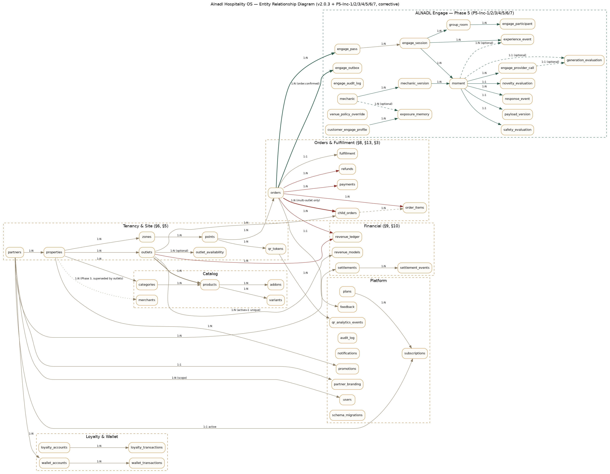

> **Version:** v2.15.0-operational-closure · **Status:** Phase 1-5 + UX-0..5 + Go-Live P0/P1 + Operational Closure · **Last Updated:** 2026-08-19

# Alnadl Hospitality OS — Database Schema

المصدر الفعلي (Single Source of Truth) لهذا المخطط هو `db.js`. هذا المستند شرح مقروء له، وليس بديلاً عنه — عند أي تعارض، الكود هو المرجع.

المحرك: SQLite (عبر `node:sqlite` المدمج في Node، بدون أي مكتبة خارجية). الملف: `data.sqlite` يُنشأ تلقائيًا عند أول تشغيل.

---

## خريطة العلاقات (ERD، Q15)

**رسم فعلي محدَّث** (وليس نصيًا تقريبيًا) — يُولَّد من `docs/erd.dot` عبر Graphviz:
```
dot -Tpng docs/erd.dot -o docs/erd.png
```



الرسم النصي أدناه يبقى كمرجع سريع (لا يغطي كل الجداول الـ34 — راجع الرسم أعلاه أو `db.js` نفسه للقائمة الكاملة):
```
partners (1) ──< properties (1) ──< zones (1) ──< points (1) ──< qr_tokens
   │                  │
   │                  ├──< outlets (1) ──< outlet_availability
   │                  │            └──< products (Phase 4، يحل محل merchants تدريجيًا)
   │                  └──< categories (1) ──< products (1) ──< variants
   │                                              │        └──< addons
   │
   ├──< subscriptions (1:1) >── plans
   ├──< settlements ──< settlement_events
   ├──< wallet_accounts ──< wallet_transactions
   ├──< partner_branding (1:1)
   └──< orders ──< order_items
                ├──< child_orders (Phase 4، عند تعدد المنافذ فقط) ──< order_items
                ├──< payments
                ├──< refunds (Phase 4، Q03)
                ├──< fulfillment (1:1)
                └──< feedback

outlets ──< revenue_models (نموذج واحد نشط) ──< revenue_ledger >── orders
loyalty_accounts ──< loyalty_transactions
qr_tokens ──< qr_analytics_events
users (كل مستخدم مرتبط بـ partner_scope اختياري لعزل الشركاء)
audit_log / notifications (سجلات مستقلة، مرتبطة بـ order_id أو entity id نصيًا وليس FK صارم)
promotions (مرتبط بـ property_id)
schema_migrations (Q08 — سجل تتبّع Migrations المُطبَّقة)
```

---

## الجداول

### `partners` — الشريك التجاري
| العمود | النوع | ملاحظات |
|---|---|---|
| id | TEXT PK | مثال: `pt_nova` |
| name_ar / name_en | TEXT | |
| legal_name | TEXT | الاسم القانوني للعقد |
| contract_ref | TEXT | مرجع العقد |
| status | TEXT | `Active` افتراضيًا |

### `properties` — المنشأة (فندق/مقر/مدينة ألعاب) التابعة لشريك
`partner_id` → `partners.id`. تحمل `timezone` و`address`.

### `zones` — منطقة داخل المنشأة (Lobby, Pool, Meeting Rooms...)
`property_id` → `properties.id`. `type` نصي حر (Lounge/Leisure/Business...).

### `points` — نقطة خدمة دقيقة (طاولة/غرفة/مقعد)
`zone_id` → `zones.id`. `active` يتحكم بإمكانية الطلب من هذه النقطة دون حذف تاريخها.

### `qr_tokens` — رمز QR فريد لكل نقطة
`point_id` → `points.id`. `token` هو الجزء الذي يُشفَّر داخل رمز QR الفعلي ويُستخدم في `GET /api/qr/:token`. **نقطة واحدة قد تملك أكثر من Token عبر الزمن** (عند إعادة الطباعة) — القديم يُعطَّل (`active=0`) بدل حذفه، حفاظًا على تتبع الطلبات التاريخية.

### `categories` / `products` / `variants` / `addons` — القائمة
- `categories.property_id` → `properties.id`
- `products.category_id` → `categories.id`، ويحمل `base_price` و`tax_code`
- `variants.product_id` → `products.id`، `price_delta` يُضاف إلى السعر الأساسي (مثال: حجم كبير +5)
- `addons.product_id` → `products.id`، `required` يحدد إن كانت الإضافة إلزامية

### `orders` — الطلب (الجدول المركزي)
| العمود | ملاحظات |
|---|---|
| id | صيغة `ORD-####` — **بدون أي رمز `#`** لأنه يكسر الروابط (فُهم هذا من اختبار فعلي أثناء البناء) |
| partner_id / property_id / zone_id / point_id | تُنسخ وقت الإنشاء لتسريع الاستعلامات وحفظ السياق حتى لو تغيّرت بنية المناطق لاحقًا |
| status | القيمة الحالية من آلة الحالة — راجع `lib/statemachine.js` |
| subtotal / vat / total | `vat` تُحسب دائمًا 15% على `(subtotal - discount_amount)` |
| promo_code / discount_amount | تُملأ فقط إن استُخدم كود خصم |
| payment_ref | مرجع ثابت يُستخدم لضمان Idempotency عند إعادة محاولة الدفع |
| cancel_reason | إلزامي عند `status = Cancelled` |

### `order_items` — بنود الطلب
`variant_json` و`addons_json` يخزنان **لقطة** (Snapshot) من الخيار وقت الطلب — وليس مرجعًا حيًا لجدول `variants`/`addons`، بحيث لا يتغير طلب قديم إذا عُدِّل سعر منتج لاحقًا.

### `payments` — سجل محاولات الدفع
`gateway_ref` هو ما ترجعه بوابة الدفع (حاليًا `MockGateway`، لاحقًا بوابة حقيقية). `status`: `Captured` أو `Failed`. طلب واحد قد يملك أكثر من صف هنا فقط إذا أُعيدت المحاولة بعد فشل (وليس بعد نجاح — الـ Idempotency تمنع ذلك).

### `fulfillment` — توقيتات دورة حياة الطلب التشغيلية
صف واحد لكل طلب (`order_id` PK)، يُحدَّث تدريجيًا: `accepted_at → preparing_at → ready_at → out_at → delivered_at`. هذا هو مصدر حساب "متوسط زمن التجهيز/التسليم" في لوحة M01.

### `settlements` + `settlement_events` — التسوية المالية (A06)
`settlements.status` يتبع سير الحالات: `Draft → Reviewed → Partner Review → Approved/Disputed → Paid`. **القيم المالية (`share_rate`, `partner_share`...) تُحفظ كنسخة ثابتة وقت الإنشاء** ولا تتغير أبدًا لاحقًا حتى لو عُدِّلت نسبة الشريك مستقبلاً — هذا يطبّق مبدأ "الشفافية وعدم المساس بالماضي" المذكور في وثيقة المفهوم (§23). `settlement_events` سجل تدقيق منفصل لكل انتقال حالة.

### `audit_log` — سجل تدقيق شامل
كل عملية حساسة (تغيير حالة طلب، تعديل مستخدم، تغيير باقة...) تُسجَّل هنا بالفاعل (`actor`) ودوره والقيمة قبل/بعد والسبب إن وُجد.

### `plans` / `subscriptions` — الباقات التجارية (SaaS، §12)
`plans` ثابتة (OPERATE/SMART/CONNECT/PLATFORM) وتحمل `features_json` (خريطة مزايا boolean). `subscriptions.partner_id` **فريد** (UNIQUE) — شريك واحد له اشتراك فعّال واحد فقط في كل لحظة؛ ترقية الباقة تستبدل الصف عبر `ON CONFLICT`.

### `promotions` — أكواد الخصم
`property_id` يربط الكود بمنشأة محددة (لا يعمل الكود عبر منشآت أخرى). `discount_type`: `percent` أو `flat`.

### `notifications` — سجل أحداث الإشعارات
بديل مؤقت لمزوّد SMS/Email/Push حقيقي (راجع README لتفاصيل نقطة التمديد).

### `feedback` — تقييم العميل بعد التسليم
`order_id` بلا FK صارم (تصميم مقصود، راجع "قيود التصميم" أدناه).

### `loyalty_accounts` / `loyalty_transactions` — الولاء والمكافآت (§15)
`loyalty_accounts.customer_key` هو رقم جوال العميل (فريد UNIQUE) — يُنشأ تلقائيًا عند أول استعلام رصيد أو أول طلب. `loyalty_transactions` سجل تدقيق كامل لكل حركة (`earn_on_delivery` أو `redeem_at_checkout`) مع ربطها بالطلب المسبب. معادلة الكسب/الاستبدال موثّقة في `lib/loyalty.js` (1 نقطة/ريال كسبًا، 20 نقطة=1 ريال استبدالًا).

### `merchants` — الشركاء التجاريون (Marketplace/Restaurant Integration، §9)
`property_id` → `properties.id`. `kind`: `alnadl` (مُشغَّل من النادل، يظهر دائمًا) أو `partner_restaurant` (يظهر فقط إن كانت باقة الشريك تشمل `marketplace`). `commission_rate` نسبة عمولة النادل على مبيعات هذا الشريك التجاري (منفصلة عن `share_rate` الخاص بتسوية الشريك الرئيسي).

### `wallet_accounts` / `wallet_transactions` — المحفظة المؤسسية (§8/§14)
`wallet_accounts.owner_ref` معرّف الجهة المستخدم في الربط عند الدفع (`GET /api/wallets/lookup`). `monthly_budget` و`spent_this_period` يحدّدان السقف الكلي؛ `policy_json` يحمل قواعد إضافية مرنة (حاليًا `perOrderCap` فقط، قابل للتوسعة لاحقًا لقيود توقيت/تصنيف دون تعديل المخطط). `wallet_transactions` سجل كل خصم فعلي، مرتبط بالطلب المسبب.

### `outlets` — المنافذ (Phase 4 §6)
`property_id` → `properties.id`. `type`: coffee/restaurant/bakery/service/other. `operator`: alnadl/partner/third_party. `commission_rate` قيمة موروثة من Merchants (Phase 3)، تُستخدم كنموذج إيراد ضمني حتى يُعرَّف نموذج صريح في `revenue_models`. `legacy_merchant_id` يحفظ تتبّع الترحيل من أي صف `merchants` نشأ هذا المنفذ.

### `outlet_availability` — ربط منفذ↔منطقة/نقطة **مع بُعد زمني** (§5)
منفذ **بلا أي صف هنا** متاح دائمًا وفي كل مكان — هذا ما يجعل كل منفذ مُرحَّل من Increment 1 يعمل دون أي إعداد إضافي. وجود صفوف يُقيِّد التوفر بمنطقة/نقطة/يوم/نطاق وقت محدد.

### `qr_analytics_events` — سجل خام لأحداث QR (§5)
صف واحد لكل مسح فعلي (`GET /api/qr/:token` أو `/api/service-hub/:token`) أو طلب فعلي — وليس عدادًا مُجمَّعًا مُخزَّنًا؛ كل مؤشرات التحليلات (نسبة التحويل، آخر مسح...) تُحسب من هذا السجل عند الطلب.

### `child_orders` + `order_items.child_order_id`/`outlet_id` (Phase 4 §8/§13)
طلب بمنفذ واحد **لا ينشئ أي صف هنا إطلاقًا** — يبقى مطابقًا 100% لسلوك ما قبل Phase 4. طلب يمتد لأكثر من منفذ (فقط إن كانت الباقة تشمل `unifiedCart`) ينشئ صفًا لكل منفذ، وتُحدَّث `order_items.child_order_id` لتربط كل سطر بالطلب الفرعي الصحيح. `orders.status` للطلب الأصلي **يُشتق تلقائيًا** من حالات الأبناء (`deriveParentStatus()` في `server.js`) ولا يُكتب مباشرة أبدًا عند وجود أبناء.

### `revenue_models` + `revenue_ledger` (Phase 4 §9/§10)
نموذج واحد نشط لكل منفذ (`active=1`)؛ تغيير النموذج يُعطِّل القديم (`active=0`) بدل حذفه — تاريخ كامل محفوظ. **`revenue_ledger` يُكتب مرة واحدة فقط عند نجاح الدفع، وكل سطر يحمل `model_snapshot_json`** (لقطة كاملة من النموذج المستخدم وقتها) — هذا يضمن أن تغيير نموذج منفذ لاحقًا لا يُعيد كتابة أي معاملة تاريخية أبدًا، بنفس فلسفة `settlements` في Phase 3.

### `partner_branding` (Phase 4 §11/§12)
صف واحد لكل شريك (`partner_id` PK). شريك بلا صف هنا (كل الشركاء افتراضيًا) يُعرَض بعلامة النادل الافتراضية. يحمل أيضًا نموذجًا تجاريًا مستقلاً تمامًا (`fee_model`, `setup_fee_amount`, `recurring_fee_amount`) عن نموذج إيراد أي منفذ تابع له.

### Phase 5 P5-Inc-6 — Feature Flags الكاملة + Roles المُدمَجة
**`venue_policy_override.scope_type`** يشمل الآن `global` (بجانب partner/property/zone الموجودة) — عمود واحد إضافي في القيد فقط، لا جدول جديد. `engage_enabled` (المفتاح الرئيسي لتفعيل Engage) له الآن نفس سلسلة الأولوية الكاملة المُثبَتة لـCeiling وNovelty: **Global Safety (`lib/engage-flags.js` — مفتاح إيقاف طارئ، SuperAdmin فقط) → Partner Contract (`plans.features_json.engage_enabled`، من Inc-1) → Property Override → Zone Override**. المستوى الأدنى **لا يمكنه أبدًا** تجاوز رفض Global أو Contract — نفس منطق `min()` من `resolveCeiling()` بالضبط، بصيغة Boolean بدل رقمية.

**الأدوار الجديدة (`SafetyReviewer`, `ProductAdmin`)**: قيم نصية عادية في عمود `users.role` **الموجود فعليًا** — لا جدول صلاحيات منفصل، ولا قيد CHECK يحتاج تعديلاً (تحقَّقنا: العمود لا يحمل قيدًا من الأساس). `SafetyReviewer` يصل لـLedger الكامل (`GET /api/admin/engage/ledger`)، `ProductAdmin` يصل للـOverview المُجمَّع فقط (`GET /api/admin/engage/overview`) — **وليس** الـLedger الكامل، تطبيقًا حرفيًا لـ"بيانات شخصية حسب الحاجة فقط".

### تصحيح دلالي: `max_participants` يشمل المُضيف
`createInvite()` تُدرج الآن صف `engage_participant` بـ`role='host'` فور إنشاء الغرفة — `max_participants` الافتراضي 8 يعني **إجمالي 8 أشخاص شاملاً المُضيف** (مُضيف + 7 مدعوين كحد أقصى)، وليس مُضيف + 8 مدعوين كما كان الحال قبل هذا التصحيح. لم يتغيّر منطق التحقق الذري في `joinInvite()` — يُحصي المُضيف تلقائيًا بصفته صفًا حقيقيًا في نفس الجدول.

### تصحيح: سلامة حد المشاركين تحت التزامن الحقيقي
`joinInvite()` يفحص السعة ويُدرج المشارك عبر **جملة SQL ذرّية واحدة** (`INSERT ... SELECT ... WHERE`) بدل استعلامي `COUNT` ثم `INSERT` منفصلين — مُختبَر فعليًا بـ10 طلبات انضمام متزامنة حقيقية (`Promise.all`) على غرفة سعتها 8: 8 نجاح بالضبط، 2 رفض، صفر تجاوز للسقف.

### تصحيح حرج: ربط الحوكمة بالتخديم الفعلي — بلا Migration جديدة (منطق فقط)
**فجوة حقيقية مؤكَّدة**: استعلام التخديم الإنتاجي كان مُثبَّتًا حرفيًا على `category='static_fallback' AND lifecycle_state='promoted'` — آليات `canary` لم تكن تصل لأي عميل حقيقي إطلاقًا (0%، بغض النظر عن `canary_percentage`)، وأي آلية بحوكمة Mechanic Lab لم تكن لتصل لعميل حقيقي حتى بعد اعتمادها بالكامل. **الحوكمة كانت حقيقية، منفصلة تمامًا عمّا يُخدَّم فعليًا**. أُصلح بـ`resolveEligibleMechanicVersion()` — دالة تخصيص حتمية (HMAC على `${profile.id}:${mechanicVersionId}`، 10000 حاوية) تحل محل الاستعلام الثابت، مُتحقَّق منها عبر HTTP حقيقي (2000 جلسة فعلية، هدف 5% → 5.50% فعليًا قبل التوثيق الرسمي، 5.265% على 20000 هوية في مجموعة الاختبار النهائية).


### Go-Live P0 — جداول وأعمدة الولاء والتحقق (`migrations/015_loyalty_partner_scope.js`)

**تغيير بنيوي حقيقي**: `loyalty_accounts` كان يحمل `customer_key TEXT UNIQUE` — قيد يجعل عزل الشريك **مستحيلًا بنيويًا** (نفس الرقم لا يمكن أن يوجد لدى شريكين). SQLite لا يسمح بإسقاط قيد عمود، فأُعيد بناء الجدول (نفس أسلوب المهاجرة 001) مع حفظ كل صف ورصيد.

| العمود الجديد | الغرض |
|---|---|
| `partner_id` | نطاق الشريك — المفتاح المنطقي الآن `(partner_id, customer_key)` عبر فهرس جزئي فريد |
| `migration_status` | `active` / `needs_review` / `orphan_no_orders` — راجع قاعدة عدم التخمين أدناه |
| `verification_status` | `unverified` / `verified` — **مستقل عن أي مزوّد نقل** |

**قاعدة الترحيل (§9) — التصنيف لا التخمين**: الحساب القديم يُنسب لشريك **فقط** إذا لمس تاريخ طلباته شريكًا واحدًا يقينًا. المتعدد يُحجر (`needs_review`)، وعديم التاريخ يُحجر (`orphan_no_orders`). المحجوز **غير مرئي** لأي بحث مُقيَّد بالشريك — فلا يُصرف رصيد لم يُطالب به أحد — لكن **الصف والرصيد محفوظان**، لا يُحذفان.

**`verification_challenges`** (جديد): `id, partner_id, customer_key, channel, code_hash, status, attempts, created_at, expires_at, consumed_at`. **الرمز يُخزَّن مُجزَّأً فقط**، ولا يُحفظ نصًا صريحًا إطلاقًا.

### جداول Mechanic Lab — Phase 5 P5-Inc-8 (`migrations/014_engage_inc8.js`)
**ملاحظة مهمة**: قيد `mechanic_version.lifecycle_state` كان **موجودًا فعليًا منذ Inc-2** (`migration 006`) ويشمل الحالات الثماني كاملة (`draft/simulated/canary/emerging/promoted/held/rejected/retired`) — لم تكن هناك حاجة لتوسيعه، فقط لبناء منطق الحوكمة الفعلي فوقه لأول مرة.

- **`mechanic_version.canary_percentage`** — عمود جديد (REAL، Nullable)
- **`mechanic_lifecycle_event`** — تدقيق كامل لكل انتقال: `reason`، `metrics_snapshot_json` (لقطة **وقت الانتقال نفسه**، لا يُعاد حسابها لاحقًا)، `actor`، `is_system_decision`، `policy_version`
- **`mechanic_safety_incident`** — حادثة أمان مفتوحة تمنع الترقية حتى تُحلّ صراحة (`SafetyReviewer`/`SuperAdmin`)
- **`mechanic_simulation_run`** — نتائج الجلسات المحاكاة، **بمعزل تام** عن `engage_session`/`moment` الحقيقية — لا يمكن لمحاكاة الوصول لعميل حقيقي أو تلويث الـLedger بنيويًا

**الآليات الخمس الحاسمة كلها مُختبَرة مباشرة**: Canary≤5% (سقف صلب غير قابل للتهيئة إطلاقًا)، حد أدنى للعينة قابل للتهيئة (افتراضي 100)، منع الترقية مع حادثة أمان مفتوحة، Kill Switch فوري (SuperAdmin فقط، يتجاوز الرسم البياني العادي)، وحماية ذرّية (CAS) ضد تعارض Promote/Hold/Kill.

**خلل حقيقي اكتُشف أثناء كتابة اختبار السباق نفسه**: التصميم الأول للاختبار افترض أن "ترقية" و"إيقاف طارئ" متزامنَين يجب أن يتعارضا (فوز واحد فقط) — لكن `transitionLifecycle()` متزامنة بالكامل بلا أي `await` داخلي، فكل استدعاء يقرأ الحالة الحيّة الفعلية دائمًا، فالعمليتان المختلفتان تتسلسلان بشكل صحيح بدل التعارض. هذا كشف عن ثغرة حقيقية أدق: تحديث CAS ذاتي المرجع (نفس الحالة للحالة نفسها) كان يُبلَّغ خطأً كـ`changes=1` رغم عدم حدوث تغيير فعلي — أُصلح بفحص صريح لمنع الانتقال الذاتي، مما يجعل السباق الحقيقي (عمليتان متطابقتان متزامنتان) يُختبَر بشكل صحيح الآن.

### تصحيح: تسمية صادقة + بنية Embedding حقيقية — Phase 5 P5-Inc-7 (`migrations/013_engage_inc7_corrective.js`)
- **`novelty_evaluation.method`** — القيد وُسِّع ليشمل `semantic_concept_similarity` كقيمة صريحة منفصلة عن `semantic_embedding` — الأخيرة **لا تُسجَّل الآن إلا عند تشغيل تشابه Vector حقيقي فعليًا**
- **`exposure_memory`** — أعمدة جديدة `embedding_vector_json`/`embedding_model`/`embedding_model_version` (كلها Nullable — فشل توليد Embedding لا يكسر الصف، بل يُخزَّن ببساطة بلا متجه)
- **`engage_provider_call`** — عمود جديد `call_type` (`'generation'`/`'embedding'`) — استدعاءات Embedding تُسجَّل في **نفس الجدول الموحَّد**، وليس جدولاً موازيًا

### جداول الذكاء الاصطناعي والأمان — Phase 5 P5-Inc-7 (`migrations/012_engage_inc7.js`)
- **`engage_provider_call`** — كل محاولة استدعاء مزوّد (المزوّد الأساسي، والمحاولة البديلة الواحدة المسموحة إن استُدعيت)، بكل حقول §25.4 الإلزامية: `provider`/`model`/`model_version`/`latency_ms`/`result`/`cost_estimate`
- **`generation_evaluation`** — يربط اللحظة بمحاولة المزوّد التي أنتجت محتواها الفعلي (عند نجاح AI فقط)
- **`safety_evaluation`** — نتيجة بوابة الأمان (Cultural/Age/Playability)، **تُسجَّل لكل لحظة مُقدَّمة دائمًا**، سواء أتت من AI أو من المجموعة الثابتة الاحتياطية — لا فقط للمحتوى المولَّد بالذكاء الاصطناعي
- **`engage_ai_generation`** — عمود جديد في `plans.features_json` لكل الباقات (افتراضي `false`)، بنفس نمط `engage_enabled` من Inc-1

**تصحيح دلالي مُكتشَف أثناء البناء نفسه (قبل أي اختبار)**: التسلسل الصحيح يتطلب إنشاء صف `moment` **أولًا** (بمعرّف حقيقي)، **قبل** استدعاء منسّق الذكاء الاصطناعي — لأن `engage_provider_call`/`safety_evaluation` تحمل قيد FK حقيقي نحو `moment(id)`. المسودة الأولى حاولت استدعاء المنسّق قبل إنشاء اللحظة، فرُفض الإدراج فورًا بخطأ FK حقيقي — أُصلح بإعادة ترتيب التسلسل قبل أي اختبار HTTP.

### جدول اختباري داخلي (ليس جزءًا من المخطط الإنتاجي)
`_test_mock_ai_behavior` — جدول صغير يُنشَأ ذاتيًا (`CREATE TABLE IF NOT EXISTS`) بواسطة `lib/engage-ai-provider.js` لتخزين إعدادات محاكاة سلوك المزوّد (نجاح/تأخر/خطأ/تشوّه/غير آمن) **في نفس ملف SQLite المشترك** — وليس متغيرًا في الذاكرة. **خلل حقيقي حرج اكتُشف في أول تشغيل اختباري فعلي**: التصميم الأول استخدم دالة JavaScript محفوظة في الذاكرة للتحكم بسلوك المحاكاة — لكن خادم الاختبار الحقيقي يعمل كعملية نظام تشغيل منفصلة تمامًا (`spawn`)، فلا تشارك الذاكرة مع عملية الاختبار إطلاقًا؛ أي إعداد محاكاة كان يُضبَط في عملية الاختبار **لم يكن له أي أثر على الخادم الفعلي** الذي يُعالج طلبات HTTP. أُعيد التصميم بالكامل ليعتمد على قاعدة البيانات المشتركة فعليًا (نفس النمط المُثبَت لضبط حالة Rate Limiting في اختبارات Inc-5). **جدول مماثل** `_test_mock_embedding_behavior` أُضيف في الجولة التصحيحية لنفس الغرض تحديدًا لمزوّد الـEmbedding — بنفس الدرس المُطبَّق من البداية هذه المرة، لا خطأً يتكرر.

### جداول الدعوة الجماعية — Phase 5 P5-Inc-5 (`migrations/010_engage_inc5.js`)
- **`group_room`** — `session_id` يربط الغرفة بجلسة المُضيف الأصلية (الاتجاه الوحيد المسموح: Engage→Core لا يزال محفوظًا، هذا ربط داخل Engage نفسه). `invite_token` عشوائي تشفيريًا (24 بايت)، مُنفصل تمامًا عن `access_token` الخاص بالجلسة — تسريب رمز الدعوة (المُصمَّم للمشاركة أصلًا) لا يكشف أبدًا قدرة المُضيف الخاصة. `expires_at` = وقت الإنشاء + 30 دقيقة، **لكن الانتهاء الفعلي يُفرَض بشرطين معًا عند الانضمام**: الوقت لم ينتهِ **و** جلسة المُضيف لا تزال `running` — أيهما يتحقق أولًا يُبطل الدعوة
- **`engage_participant`** — لا `session_id` خاص بالمدعو ولا أي ربط بطلب/دفع — المدعو لا يحتاج Pass/Session مستقلة إطلاقًا، مطابقةً لـ§25.6 حرفيًا. `max_participants` الافتراضي 8، **لا يمكن رفعه أبدًا فوق هذا السقف** حتى لو طلب المُضيف صراحة رقمًا أكبر (يُقيَّد للـ8 بصمت عند الطلب، لا يُرفَض — فرق متعمَّد عن تحقق Novelty الصارم في التصحيح السابق، لأن هذا سقف أمان وليس مدخل بيانات خاطئ الصياغة)

**Rate Limiting على الانضمام**: يُعيد استخدام نفس نمط `isRateLimited`/`recordFailedAttempt` من `lib/auth.js` (تسجيل الدخول) حرفيًا، بمفتاح `invite_token` بدل اسم المستخدم — لا بنية Rate Limiting جديدة.

### تصحيح: تطبيع الهاتف + Pseudonymization عبر HMAC (بلا Migration جديدة — منطق فقط)
`customer_engage_profile.identity_ref` **لم يعد يُخزِّن رقم الهاتف الخام أبدًا** — `lib/engage-novelty.js` يُطبِّع الصيغ الشائعة أولًا (`normalizePhone`) ثم يُحوِّلها لـ HMAC-SHA256(المفتاح=`SESSION_SECRET`، المُدخَل=`partnerId:normalizedPhone`) عبر `pseudonymizeIdentity`. نفس الرقم بأي صيغة سعودية شائعة يُطبَّع لنفس القيمة، ومعرّف الشريك جزء من HMAC نفسه (عزل مزدوج: بعمود `partner_id` وبالمُدخَل المُشفَّر معًا).

### جداول الذاكرة ومنع التكرار — Phase 5 P5-Inc-4 (`migrations/009_engage_inc4.js`)
- **`customer_engage_profile`** — `UNIQUE(partner_id, identity_ref)`؛ هذا القيد نفسه هو ما يضمن عزل الذاكرة بين الشركاء هيكليًا: نفس رقم الهاتف لدى شريكين مختلفين ينتج صفَّين منفصلين تمامًا، لا صفًا واحدًا مشتركًا. `is_anonymous=1` للعملاء المجهولين — كل Pass مجهول (بلا `identity_ref`) يحصل على ملف جديد خاص به فقط (لا تتبّع دائم عبر زيارات مجهولة متعددة، قرار خصوصية متعمَّد)
- **`exposure_memory`** — `content_hash` (تطابق حرفي فوري) + `token_set_json` (قائمة الكلمات المُجزَّأة، تُمكِّن حساب Jaccard حقيقي على التكرار شبه الحرفي، وليس تطابقًا حرفيًا فقط)
- **`novelty_evaluation`** — `method` مُقيَّد بـ`text_similarity`/`semantic_embedding`؛ **الإصدار الحالي لا يُنتج `semantic_embedding` في أي مسار كود إطلاقًا** — يبقى محجوزًا لـInc-7. `ENG-NOV-001` يبقى **Partial** وليس Done.

**إعادة استخدام `venue_policy_override`**: نافذة الذاكرة (`novelty_window_days`) وعتبة التشابه (`novelty_threshold`) قابلتان للتهيئة عبر **نفس** جدول وسلسلة أولوية Ceiling المُثبَتة في Inc-2 (Zone→Property→Contract→Default)، بمفاتيح `policy_key` مختلفة فقط — لا بنية جديدة.

### تصحيح: Tenant Scoping عند مستوى SQL (لا فلترة JavaScript لاحقة)
`lib/engage-ledger.js` — كلٌ من `getPartnerOverview()` و`getFullLedger({partnerId})` يُصفِّيان الآن عبر `WHERE json_extract(context_snapshot_json, '$.partnerId') = ?` (معامل مُربَوط) داخل الاستعلام نفسه — وليس جلب كل الصفوف ثم `.filter()` في Node. مُختبَر بزرع بيانات شريكين وتحقُّق عدد دقيق لكل واحد + فحص مباشر على نص الكود يُثبت غياب أي فلترة لاحقة متبقية.

### جداول Experience Ledger — Phase 5 P5-Inc-3 (`migrations/008_engage_inc3.js`)
- **`moment.selection_reason`** — عمود إضافي جديد؛ يُسجِّل صراحة *لماذا* اختير هذا المحتوى (حاليًا: Round-Robin ثابت، بصياغة صادقة تصف الواقع فعليًا وليس منطق ذكاء اصطناعي غير موجود بعد)
- **`experience_event`** — سجل دورة حياة الجلسة الكامل (`session_start`/`moment_served`/`moment_completed`/`moment_skipped`/`session_end`)، كل صف بختم زمني حقيقي
- **`response_event`** — استجابة العميل الفعلية لكل لحظة، مع `idempotency_key` (فهرس فريد جزئي `WHERE idempotency_key IS NOT NULL`) يمنع تسجيل نفس التفاعل مرتين عند إعادة إرسال الطلب

**العزل المعماري محفوظ بالكامل**: كل جدول أعلاه Engage بحت — لا عمود ولا قيد جديد على أي جدول Core.

### تصحيح أمني — Capability Tokens (`migrations/007_engage_session_auth.js`)
**`engage_pass.access_token`** و**`engage_session.access_token`** (عمودان إضافيان، `UNIQUE`، عشوائيان تشفيريًا 24 بايت) — الآن **السبيل الوحيد** لعنونة أي Pass/Session من واجهة العميل؛ لا يُقبَل `id` الداخلي كمُدخَل بعد الآن في أي نقطة نهاية Engage. يُغلق ثغرة IDOR حقيقية كانت موجودة في الإصدار الأول من Inc-2 (الاعتماد على `id` وحده، القابل للتخمين نظريًا). راجع `docs/PHASE5_GAP_ANALYSIS.md` قسم "الجولة التصحيحية الأمنية" للتفصيل الكامل.

### جداول ALNADL Engage — Phase 5 P5-Inc-2 (`migrations/006_engage_inc2.js`)
- **`properties.venue_context`** — عمود إضافي جديد (`corporate`/`coffee`/`hotel`/`entertainment`/`vip_lounge`)، الإشارة الأساسية لمحرك الشخصية عند غياب إشارة منطقة أقوى
- **`mechanic`/`mechanic_version`** — بنية تحتية مشتركة مع Mechanic Lab المستقبلية (Inc-8)؛ Inc-2 يزرع فقط 5 آليات ثابتة مُعتمَدة مسبقًا (`lifecycle_state='promoted'`, `created_by='alnadl_admin'`) — واحدة لكل شخصية، تمثيل حرفي لمتطلب "Approved Static/Fallback Content"
- **`moment`/`payload_version`** — كل لحظة مُقدَّمة فعليًا للعميل + المحتوى الحرفي المعروض (غير قابل للتعديل بعد إنشائه)
- **`venue_policy_override`** — جدول التخصيص الهرمي (`scope_type`: partner/property/zone، `policy_key`: مثال `ceiling_MIND`) — يُطبَّق عبر `lib/engage-personality.js` بصيغة `min()` مُتسلسلة تضمن أن لا مستوى أدق يتجاوز Global Safety أو قيدًا تعاقديًا أعلى

### جداول ALNADL Engage — Phase 5 P5-Inc-1 (`migrations/004_engage_inc1.js`)
**اتجاه الاعتماد مؤكَّد ومُختبَر**: `Engage → Core` حصريًا — `engage_pass.order_id` قيد `FOREIGN KEY ... REFERENCES orders(id)` **حقيقي** (`ON DELETE CASCADE ON UPDATE CASCADE`)، مُختبَر فعليًا برفض إدراج بمرجع غير صالح. لا جدول Core (`orders`, `payments`...) يحمل أي عمود أو قيد نحو Engage. تدفق البيانات (وليس الاعتماد) يسير بالاتجاه المعاكس: `Core → Engage` عبر `order.confirmed` → صف واحد في `engage_outbox` (كتابة محلية غير مشروطة، لا قرار Engage-specific داخل Core).

- **`engage_pass`** — بوابة الأهلية؛ لا صف بلا `order_id` صالح لطلب مدفوع فعليًا. `context_snapshot_json` لقطة ثابتة وقت الإصدار (نفس مبدأ `revenue_ledger.model_snapshot_json`)
- **`engage_session`** — بنية فقط في Inc-1 (`personality` NULLABLE)؛ التعبئة الفعلية مؤجَّلة لـInc-2
- **`engage_outbox`** — آلية الربط غير المتزامنة الوحيدة؛ `status`: `pending → processed` (Flag ON) أو `skipped` (Flag OFF، الحالة الافتراضية لكل الباقات اليوم) أو `dead_letter` (فشل نهائي بعد استنفاد `max_attempts`). **سياسة إعادة محاولة حقيقية** (جولة تصحيحية v2.0.5): `attempts`/`max_attempts` (افتراضي 5)/`next_attempt_at` (Backoff أُسِّي، سقف 30 ثانية)/`last_error` — فشل عابر يُبقي الصف `pending` قابلاً لإعادة المحاولة لاحقًا، وليس `failed` نهائية بلا رجعة كما كان الحال قبل هذا الإصلاح
- **`engage_audit_log`** — سجل تدقيق مستقل تمامًا عن `audit_log` الأساسي (لا تداخل)

`engage_enabled` أُضيف كمفتاح جديد في `plans.features_json` لكل الباقات الأربع (القيمة الافتراضية `false` للجميع — لا باقة خامسة أُنشئت، تطبيقًا لـ§6 من وثيقة Phase 5).

### `refunds` — الاسترجاعات الكاملة/الجزئية (Q03)
سجل غير قابل للتعديل — كل استرجاع صف جديد، لا يُعدَّل أي صف قائم أبدًا. `reason` تحمل بادئة `__idem__` عند استخدام مفتاح Idempotency بدل سبب نصي حر.

### `schema_migrations` (Q08)
سجل كل Migration طُبِّقت فعليًا، بترتيبها الزمني — يمنع إعادة تطبيق نفس الترحيل مرتين. راجع `lib/migrate.js` و`migrations/`.

### قيود المفاتيح الأجنبية (Foreign Keys، Q09)
`PRAGMA foreign_keys = ON` مُفعَّل على مستوى الاتصال. قيود FK فعلية (وليست توثيقًا فقط) مُطبَّقة حاليًا على: `order_items`, `child_orders`, `payments`, `revenue_ledger` — وهي مسار المال المباشر في النظام، عبر `migrations/001_add_foreign_keys.js`. **نطاق متبقٍ صراحة**: بقية الجداول (`zones`, `points`, `products`...) لم تُرحَّل بعد لنفس النمط — انظر `docs/GAP_REGISTER.md` بند Q09.

### `properties.delivery_grouping` (Q01)
`'grouped'` (افتراضي) أو `'separate'` — يتحكم بسياسة توصيل الطلبات متعددة المنافذ. راجع `docs/MULTI_OUTLET_SPEC.md`.

### `revenue_ledger.type` (Q03)
`'sale'` (المعاملة الأصلية) أو `'refund_adjustment'` (سطر عكسي عند استرجاع) — لا يُحذف أو يُعدَّل أي سطر `sale` عند الاسترجاع، بل يُضاف سطر `refund_adjustment` جديد بمبلغ سالب.

### `users` — حسابات النظام
`partner_scope` هو FK اختياري لـ `partners.id` — `NULL` تعني مستخدمًا على مستوى النادل (SuperAdmin/AlnadlFinance) وليس مقيّدًا بشريك واحد. `password_hash` بصيغة `pbkdf2:<iterations>:<salt>:<hash>` (Q06 — 100,000 تكرار، Salt فريد لكل مستخدم عبر `node:crypto`)؛ أي صف قديم بصيغة SHA-256 مجرد (بلا بادئة `pbkdf2:`) لا يزال يُتحقَّق منه للتوافق الخلفي، لكن لا يُنتَج بهذه الصيغة القديمة أبدًا لمستخدم جديد.

---

## قيود تصميم مقصودة (يجب معرفتها قبل التوسّع)

0. **معاملات (Transactions) صريحة على مسار الدفع** (جولة تصحيحية P5-Inc-1، v2.0.5): `POST /api/orders/:id/pay` يُغلِّف الآن كل كتاباته (Payments، حالة الطلب، تعاقب Child Orders، الولاء، توزيع الإيراد، سطر `engage_outbox`) داخل `BEGIN...COMMIT` واحدة — إما تثبت جميعًا معًا أو لا يثبت أي منها. **مُختبَر فعليًا بإثبات Rollback حقيقي**، وليس افتراضًا. هذا يحل خللاً حقيقيًا كان موجودًا سابقًا: كل Statement كانت تُثبَّت فوريًا بمعزل عن الأخرى (Auto-commit)، فانهيار فعلي بين خطوتين كان بإمكانه ترك طلب `Paid` بلا أي حدث Engage مقابل، بصمت تام.
0ب. **WAL Mode مُفعَّل** (`PRAGMA journal_mode=WAL` + `busy_timeout=5000`، جولة تصحيحية v2.0.5) — اكتُشف فعليًا أن تفعيل المعاملات الصريحة أعلاه يكشف قفل قاعدة بيانات حقيقيًا (SQLite الافتراضي/Rollback Journal يقفل الملف بالكامل أثناء أي معاملة كتابة) عند أي اتصال ثانٍ متزامن. WAL يسمح بقراءات متزامنة أثناء الكتابة، وهو الوضع المُوصى به عمليًا لأي سيناريو اتصالات متعددة.

1. **Foreign Key Constraints فعلية مفروضة الآن على 4 جداول فقط من أصل 34** (`order_items`, `child_orders`, `payments`, `revenue_ledger` — مسار المال المباشر، عبر `migrations/001_add_foreign_keys.js`، Q09). بقية الـ30 جدولاً لا تزال تعتمد على منطق التطبيق (`server.js`) فقط دون قيد قاعدة بيانات فعلي — **دَين تقني مُعتمَد رسميًا**، وليس إغفالًا. راجع `docs/GAP_REGISTER.md` بند Q09 للتفصيل والخطة.
2. **الأسعار مخزنة كـ REAL (Floating point) في كل الجداول المالية دون استثناء** — هذا خطر تقريب (Rounding Risk) حقيقي وغير مُعالَج بعد، ذُكر صراحة في مراجعة الجودة النهائية (بند 13). التوصية المُعتمَدة: الانتقال لتخزين أصغر وحدة عملة كعدد صحيح (halalas، أي الريال × 100 كـ INTEGER) أو `NUMERIC/DECIMAL` عند الانتقال لـPostgreSQL (Q07)، مع قاعدة تقريب موحّدة صريحة للضريبة والخصومات والعمولات والاسترجاعات والتسويات — **هذا العمل لم يبدأ بعد**.
3. **نظام Migrations موجود وفعّال** (`lib/migrate.js` + `migrations/`, Q08) — التعديل على المخطط الآن يمر عبر ملف مُرقَّم مُتتبَّع في `schema_migrations`، **وليس** حذف `data.sqlite` وإعادة الزرع كما كان الحال قبل Q08. عند الانتقال لـPostgreSQL (Q07)، نفس نمط الملفات المُرقَّمة يبقى صالحًا مع تعديل بنية SQL فقط.

---

## Operational Closure — الدفعة (ب) · `migrations/018_payment_policy.js`

### `payment_policy_overrides`

جدول عام واحد بعمودَي نطاق (`scope_type`, `scope_id`) — **لا ثلاثة جداول متوازية**، لنفس سبب `branding_overrides`: الجداول المتوازية تتباعد، وأول تباعد بينها خلل صامت في الوراثة.

| العمود | النوع | ملاحظة |
|---|---|---|
| `scope_type` | TEXT | `partner` \| `property` \| `outlet` |
| `scope_id` | TEXT | مع `scope_type` فهرس فريد |
| `policy` | TEXT | `NULL` تعني **ورِث من الأعلى** — وهو ما يجعل الوراثة حقلًا بحقل |
| `allowed_methods_json` | TEXT | لـ`MIXED` فقط · يُقاطَع مع ما يعرفه النظام عند الحلّ |
| `updated_at` / `updated_by` | INTEGER / TEXT | كل تغيير يدخل سجل التدقيق بقبل/بعد |

**مستوى الشريك مشمول هنا بخلاف العلامة التجارية**: السياسة إعداد تشغيلي يخصّ العميل نفسه، لا نموذجًا تجاريًا تملكه النادل.

### أعمدة جديدة على `orders`

`payment_method` و`collection_status` — محوران منفصلان عمدًا (التفصيل في `API_DOCUMENTATION.md`). الطلبات القائمة تُرجَم عند الترحيل **ترجمة أمينة من حالتها الفعلية** لا بتخمين: كل ما سبق هذا المفهوم كان يُحصَّل أونلاين فعلًا.

### `orders.status` — قيمة جديدة `Confirmed`

طلب مُخلّى للمطبخ دون أن يُحصَّل من الضيف. كل استعلام يسأل «هل الطلب مُخلّى؟» يقرأ الآن من `CLEARED_TO_PREPARE` في `lib/statemachine.js` بدل قائمة نصّية مكرّرة — كانت سبع نسخ، وإضافة الحالة لكل واحدة على حدة كانت ستضمن نسيان واحدة، والنتيجة طلب حقيقي لا يظهر لأحد.

### `merchants.status` — أصبح مفعَّلًا (P1-05)

العمود موجود منذ Phase 3 بقيمة `Active` افتراضية، لكن **لم تكن أي نقطة تُغيّره ولا أي قاعدة تقرأه** غير فلتر واحد في الكتالوج: حالة موجودة على الورق ومعطّلة عمليًا. القيم الآن `Active` \| `Inactive` \| `Closed`، والقرار يُتخذ في `lib/merchant-status.js` وحده.

### `wallet_accounts` — قيد تفرّد منطقي (P1-03)

`(partner_id, owner_ref)` مفروض على مستوى التطبيق: `owner_ref` وحده **ليس** معرّفًا فريدًا عالميًا، وافتراض ذلك كان يسمح بخصم عابر للمستأجرين.

---

## Scope 2 — مهاجرات 019 · 020 · 021

| المهاجرة | المحتوى | ملاحظة |
|---|---|---|
| **019** | `outlets.merchant_id` (nullable) + فهرس | العلاقة الغائبة · `legacy_merchant_id` أثر ترحيل لا علاقة حيّة · ترحيل محافظ بشرطين: أثر موثوق **و** شريك تجاري قائم في نفس العقار |
| **020** | `brand_assets` | Metadata فقط · `partner_id` مخزَّن لا مشتقّ (كل فحص صلاحية مقارنة واحدة) · `storage_key` فريد |
| **021** | `logo_asset_id` · `banner_asset_id` · `favicon_asset_id` على `branding_overrides` | **لم يُضَف حقل واحد إلى `partner_branding`** |

**قرار 021 — نتيجة التدقيق المطلوب:** الازدواج بين الجدولين قائم أصلًا (`logo_text`، `primary_color`، `welcome_text_*`، `show_powered_by` في كليهما). التوحيد الكامل يمسّ 9 مواضع في 5 ملفات + مسار الكتابة + بيانات إنتاج حيّة. المسار المعتمد: السماح بـ`scope_type='partner'` في الجدول العام — **مدعوم بلا تغيير مخطط** لأن النطاق عمودان لا جدول لكل مستوى — ويقرأ المُحلِّل مستوى الشريك طبقتين: `partner_branding` (توافق خلفي) ثم التجاوز فوقها. بلا ترحيل بيانات، بلا كسر توافق، وبلا ازدياد الازدواج.

`scope_type='merchant'` يدخل بالمنطق نفسه: **قيمة بيانات لا هجرة**.

`mode` والرسوم تبقى في `partner_branding` حصرًا: نموذج تجاري يملكه SuperAdmin، ولا يجوز لعقار أو منفذ تغييره.
